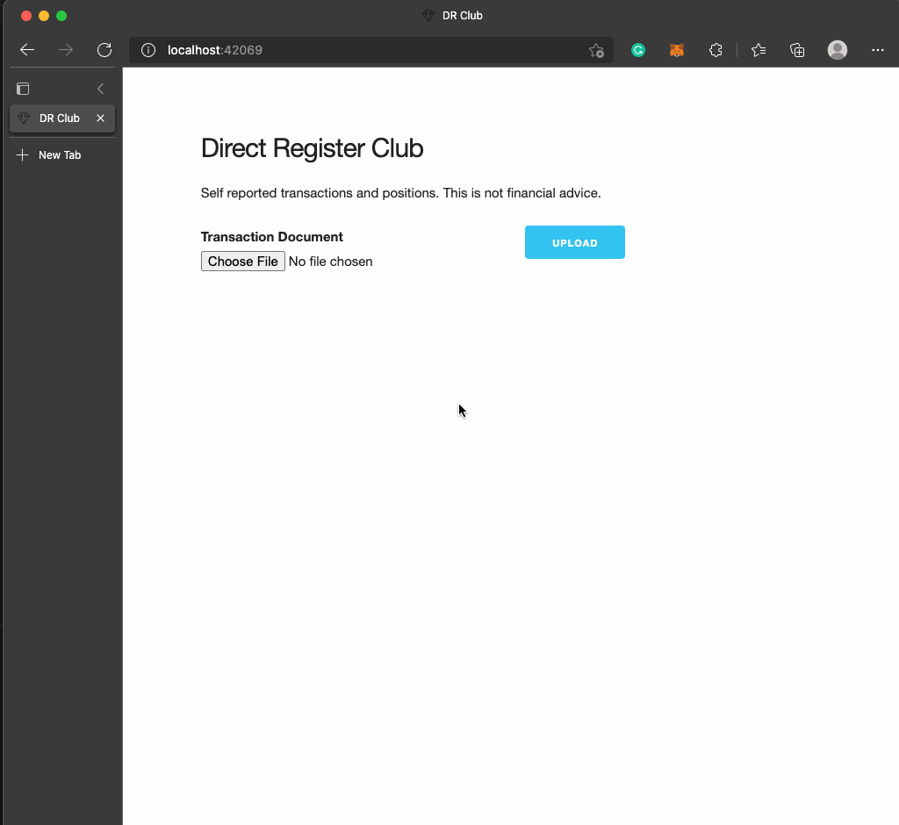

# drclub

## What is this

An application to parse transactions and positions from transfer agents -
currently supports [computershare][computershare]. This is a proof of concept.

## Why does this exist

It is speculated that a large amount of [naked short selling][nakedshortselling]
is occurring in the stock market. In reaction to that speculation certain retail
investors are buying and transferring shares directly with transfer agents.

Some enthusiastic investors started sharing screenshots of their directly
registered holdings. These screenshots are easily edited and can be difficult to
trust. These screenshots also publicly disclose positions which could result in
increased phishing or hacking attempts.

This POC was made in a search of a trustworthy, open, and private way to report
positions.

## How does it work

Uploaded Transaction documents are converted to images using [go-fitz][go-fitz]
and then those images are processed by [gosseract][gosseract].

Documents are handled in memory and personal information is never written to
disk or logged.

Account and transaction IDs are extracted and salted and hashed. This enables
deduplicating uploads while keeping accounts anonymous. The salt prevents
reversing ids with brute force hashing.

The following information is extracted and recorded: Date, CUSIP, Description,
DeductionType, OpenPosition, ClosePosition, Amount, DeductionAmount, NetAmount,
PricePerShare, and TotalShares.

Simple validation is performed to check that the document appears legitimate.
This is **not** bullet proof, just intended to make it more annoying and more
work to fake.

The request IP address is hashed and recorded to allow blocking abuse.

## Web App

A simple webapp is available to upload documents and display totals and
transactions.



## CLI Parse Tool

A tool is available to kick tires and see what would be parsed from your document.

```console
$ go run ./cmd/pdfparse /path/to/document.pdf
(store.Transaction) {
 IDHash: (string) (len=64) "f89fd9d880df2038a55599151cb4aa73e05223ac7d96644d0e7ecfc5ecdf74af",
 AccountIDHash: (string) (len=64) "3619fbd0fd04acde5afbba8627b6440520af3ef96e98cd47d42068bfd043d584",
 RequesterHash: (string) (len=64) "12ca17b49af2289436f303e0166030a21e525d266e209267433801a8fd4071a0",
 CUSIP: (string) (len=9) "36467W109",
 Description: (string) (len=22) "Optional Cash Purchase",
 Amount: (decimal.Decimal) 500,
 DeductionAmount: (decimal.Decimal) 5.15,
 NetAmount: (decimal.Decimal) 494.85,
 PricePerShare: (decimal.Decimal) 192.339,
 TotalShares: (decimal.Decimal) 2.572801,
 Date: (time.Time) 2021-09-21 00:00:00 +0000 UTC
}
```

## Dev

RUN pg in docker:

`docker run -p 5432:5432 -e POSTGRES_USER=user -e POSTGRES_PASSWORD=pass -e POSTGRES_DB=drclub -d postgres:13.2`

copy & export .env file

`cp .env.example .env && export $(grep -v '^#' .env | xargs)`

build the webapp

`cd web && yarn install && yarn build && cd -`

run the service

`go run ./cmd/server serve`

view

`open http://localhost:8080`

## License

AGPL-3.0 License

## TODOS

- [ ] Paginate transactions
- [ ] Add native geoip blocking - currently restricting to US via cloudflare,
      but would be nice to not have that dependency.
- [ ] Docs
- [ ] Tests
- [ ] Reduce the size of the chonker docker image

[computershare]: https://www.computershare.com/us
[nakedshortselling]: https://en.wikipedia.org/wiki/Naked_short_selling
[gosseract]: https://github.com/otiai10/gosseract
[go-fitz]: https://github.com/karmdip-mi/go-fitz
